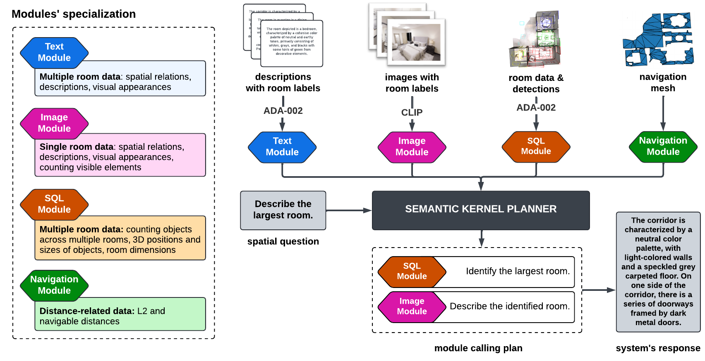
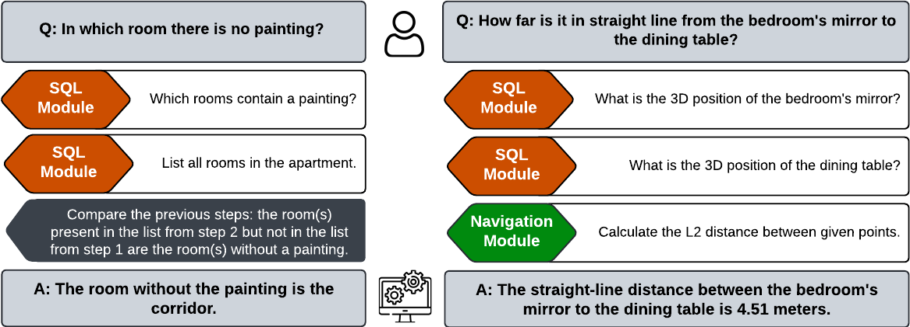

<p align="center">
<h1 align="center"><strong>RAG3D-Chat as a baseline for Space3D-Bench</strong></h1>
  <p align="center">
    <a href="https://emilia-szymanska.gitlab.io/cv/" target="_blank">Emilia Szymanska</a>&emsp;
    <a href="https://dusmanu.com/" target="_blank">Mihai Dusmanu</a>&emsp;
    <a href="https://jwbuurlage.github.io/" target="_blank">Jan-Willem Buurlage</a>&emsp;
    <a href="https://radmahdi.github.io/" target="_blank">Mahdi Rad</a>&emsp;
    <a href="https://people.inf.ethz.ch/pomarc/" target="_blank">Marc Pollefeys</a>&emsp;
    <br>
    ETH Zurich&emsp;Microsoft, Zurich
    <br>
    <strong>ECCV 2024 Workshop</strong>
  </p>
</p>


<p align="center">
  <a href="https://arxiv.org/abs/2408.16662" target='_**blank**' disabled>
    
  </a> 
  <a href="https://arxiv.org/pdf/2408.16662" target='_blank' disabled>
    
  </a> 
  <a href="https://space3d-bench.github.io/" target='_blank'>
    
  </a>
</p>


<div style="text-align: center;">
    
</div>


<p align="justify"> To generate answers for the spatial questions presented in <a href="https://github.com/Space3D-Bench/Space3D-Bench">Space3D-Bench</a>, we propose <b>RAG3D-Chat</b>, a spatial Q&A system based on two main components: <a href="https://github.com/microsoft/semantic-kernel">Semantic Kernel</a> (SK) and Retrieval Augmented Generation (RAG) within <a href="https://docs.llamaindex.ai/en/stable/">Llama Index</a> framework. Semantic Kernel, being an open-source framework for LLM-based implementation of agents, allowed for integrating four complementary modules - each with different applications and limitations - into one system. Once the modules were implemented and described with a corresponding prompt, Semantic Kernel's planner was able to propose a chain of function calls, whose result would be an answer to the input question. </p>

<div style="text-align: center;">
    
</div>

## 📋 Content

### Released repository content

In this section, we will in detail describe the code-relevant content of this repository. It was assumed that API-call-based LLM/embedding models are used, however, it is adjustable as examplained in `Getting Started` section.

<b>conf:</b>
- <i><b>logging_conf.ini</b></i>: configuration of the logging, divided into two parts - a detailed one with all the planner's decisions and steps evoked by each module, saved to <i>detailed.log</i>, and a high-level one, where only the questions and the resulting answers are logged both to the console and <i>brief.log</i>.

<details>

  <summary>Example of the logs from <i>brief.log</i></summary>

```
Which rooms have no plants?
The rooms that have no plants are the corridor and the dining room.
```

</details>


<details>

  <summary>Example of the logs from <i>detailed.log</i></summary>

```
2024-07-25 15:08:00,435 - plugins - INFO - Which rooms have no plants?
2024-07-25 15:08:13,288 - SQL - INFO - Query: Which rooms contain plants?
2024-07-25 15:08:48,991 - SQL - INFO - Most similar classes to []: set()
2024-07-25 15:08:49,317 - SQL - INFO - Most similar classes to ['plants']: {'pillar', 'plant', 'pot', 'panel', 'vent'}
2024-07-25 15:08:53,250 - SQL - INFO - SQL query: SELECT DISTINCT room FROM detected_objects WHERE class_name = 'plant';
SQLResult: living_room, kitchen, bedroom
Answer: The rooms that contain plants are the living room, kitchen, and bedroom.
2024-07-25 15:08:57,040 - SQL - INFO - Response: Plants are located in the living room, study, and bedroom.
2024-07-25 15:09:00,796 - SQL - INFO - Query: List all rooms in the apartment
2024-07-25 15:09:52,568 - SQL - INFO - SQL query: SELECT room FROM rooms
SQLResult: bedroom, corridor, dining room, living room, study
Answer: The rooms in the apartment are the bedroom, corridor, dining room, living room, and a study.
2024-07-25 15:09:54,841 - SQL - INFO - Response: The apartment consists of a bedroom, corridor, dining room, living room, and a study.
2024-07-25 15:10:04,697 - plugins - INFO - The rooms that have no plants are the corridor and the dining room.
2024-07-25 15:10:04,697 - plugins - INFO - ---
2024-07-25 15:10:04,697 - plugins - INFO - Original request: Which rooms have no plants?

You are in the process of helping the user fulfill this request using the following plan:
Plan:

1. Use the `sql-Sql` function to query for all rooms that contain plants. The query could be something like "Which rooms contain plants?".
2. Use the `sql-Sql` function again to query for all rooms in the apartment. The query could be something like "List all rooms in the apartment".
3. Compare the two lists obtained from step 1 and step 2. The rooms that are in the list from step 2 but not in the list from step 1 are the rooms that have no plants.
4. Use the `UserInteraction-SendFinalAnswer` function to return the final list of rooms that have no plants.

The user will ask you for help with each step.
```

</details>


<b>core</b>
- <i><b>config_handler.py</b></i>: definitions of classes used for handling the LLM/embedding models configurations such as endpoints, deployments, api keys etc. The configurations are read from dotenv files, and the settings corresponding to different components of the system are distinguished by a prefix (further explained in dotenv descriptions);
- <i><b>interfaces.py</b></i>: definitions of interfaces of chat- and LLM/embedding-model-related components;
- <i><b>example_implementations.py</b></i>: examples of how interfaces from `interfaces.py` can be implemented for the case of using Azure OpenAI services with Azure Identity authentication. The user of the repo will need to adjust their implementations to the type of models and services they are using;
- <i><b>rag3dchat.py</b></i>: main class of the system, combines the planner from the Semantic Kernel with RAG modules;
- <i><b>rag_document_loaders.py</b></i>: functions used for loading text and images into Llama Index's Documents;
- <i><b>rag_sql_loader.py</b></i>: functions used for creating an SQL database from a JSON file (the file needs to follow the structure of Space3D-Bench's object detections file).

<b>misc</b>
- <i><b>scenes_enum.py</b></i>: enum class with the scene names from the <a href="https://github.com/facebookresearch/Replica-Dataset">Replica dataset</a>, having vaues corresponding to the names of the folders containing the data of each scene. It is used when iterating over all the scenes, and can be extended with the scenes from other datasets;
- <i><b>navmesh_vis.py</b></i>: function used for creating a visualization of a navigation mesh (with the path and desired points marked on it) and saving it to an HTML file.

<b>plugins</b>
- <i><b>{name}_plugin.py</b></i>: plugin implementations, whose more detailed way of operation is described in the paper;
- <i><b>plugin_prompts.py</b></i>: all the prompts used in the plugins, both in the calls of chats and for the Semantic Kernel planning process;
- <i><b>plugins_factory.py</b></i>: a factory used to get plugins objects.

<b>repo's main folder</b>
- <i><b>.env</b></i>: configurations of the Semantic Kernel's LLM model. Needs to be filled in by the user of the repo if services similar to OpenAI are used. Otherwise, the user can adjust the configuration handling depending on their own use case.
- <i><b>.env_plugins</b></i>: configurations of the plugins-related LLM and embedding models. Needs to be filled in by the user of the repo if services similar to OpenAI are used. Otherwise, the user can adjust the configuration handling depending on their own use case.
- <i><b>rag3dchat_call.py</b></i>: the script iterating over all the scenes and running the RAG3D-Chat for the questions available for each scene.

#### Assumptions on the data-containing folder structure

The folder with data should be divided into subfolders, whose names (corresponding to the specific scenes accordingly) are as defined in `misc/scenes_enum.py`. Then, each subfolder should have the following structure:
```
├── img_data
    ├── room_1
        ├── img1.png
        ├── img2.png
    ├── room_2
        ├── img1.png
        ├── img2.png
    ...
├── nav_data
    ├── navmesh.txt
├── sql_data
    ├── sql_db_data.json
├── text_data
    ├── room1.txt
    ├── room2.txt
    ...
├── questions.json
├── answers.json (if already generated)
```
Some notes:
- **img_data**: although the image names do not matter, it is crucial that the folders in which they are put correspond to the room being named as the folder;
- **nav_data**: the navigation mesh should be in the format as provided by the Space3D-Bench;
- **sql_data**: the JSON file should be in the format as provided by the Space3D-Bench;
- **text_data**: files with room descriptions should have the names corresponding to the room names they describe;
- **questions.json**: keys should be the question numbers, and the content the actual question (as in Space3D-Bench);
- **answers.json**: file generated by RAG3D-Chat, keys being the question numbers, and the content the actual answer (as advised by Space3D-Bench).

In the release, we provide a zipped folder with the data used in the first implementation and tests of RAG3D-Chat. Download it and unzip it, so that the repository has a `data` folder in the structure desribed above. 


## 🚀 Getting Started

### Environment

1. Download the repository.
    ```bash
    git clone https://github.com/Space3D-Bench/RAG3D-Chat.git
    cd RAG3D-Chat
    ```
2. Prepare your python virtual environment (example shown for conda).
    ```bash
    conda create -n your_env_name python=3.10
    conda activate your_env_name
    ```
3. Install the requirements.
    ```bash
    pip install -r requirements.txt
    ```

### Preparation

Assumptions: we assume you would like to first test the chat on the Replica dataset. For simplicity, we advise you to create a `data` folder in this repository and put the data there. If you do not use Replica, keep the structure of folders as described in `Content` section and adjust `misc/scenes_enum.py`. If the data is in a different folder than `{path_to_repo}/data`, adjust paths in `rag3dchat_call.py`. We additionally assume that the contexts of RAG plugins will be saved to `.SQL_DIR`, `.TEXT_DIR` and `.IMG_DIR` - you can adjust it in `core/rag3dchat.py`.

You may use the Replica example we provide in the zipped `data` in the release in the following way:
```bash
cd path/to/repo
wget https://github.com/Space3D-Bench/RAG3D-Chat/releases/download/v0.0.1/data.zip
unzip data.zip -d .
rm data.zip
```

Then, in the folders of each scene you need to add a JSON file with questions. You can download the ones provided by the Space3D-Bench or create ones yourself. 

#### Case 1: using Azure OpenAI with Azure Identity authentication

1. Simply fill in both dotenv files in accordance to your configurations.

#### Case 2: using OpenAI-like service with another authentication method

1. Implement classes whose interfaces are present in `core/interfaces.py`. You may use the examples in `core/example_implementations.py` as the guideline.

2. Import and use your implementations in `rag3dchat_call.py`, define the Semantic Kernel's service.

3. Fill in both dotenv files in accordance to your configurations.

#### Case 3: using another way of calling LLMs/embeddings (e.g. running them locally)

1. Implement classes whose interfaces are present in `core/interfaces.py`. You may use the examples in `core/example_implementations.py` as the guideline. You may not need the handling of configurations as provided by `core/config_handler.py` and dotenv files, but make sure your models are configured.

2. Import and use your implementations in `rag3dchat_call.py`, define the Semantic Kernel's service.

## 🔍 Running the Tests


### Running

Once the preparation steps descibed in `Getting Started` sections are done, simply run the `rag3dchat_call.py` file from within your environment:
```bash
cd path/to/Space3D-Bench/repo
python rag3dchat_call.py
```

The answers to the questions will be saved to files `data/{scene_name}/answers.json`.


## 🔗 Citation
If you find our paper and project useful, please consider citing:
```bibtex
@inproceedings{szymanska2024space3dbench,
  title={{Space3D-Bench: Spatial 3D Question Answering Benchmark}},
  author={Szymanska, Emilia and Dusmanu, Mihai and Buurlage, Jan-Willem and Rad, Mahdi and Pollefeys, Marc},
  booktitle={European Conference on Computer Vision (ECCV) Workshops},
  year={2024}
}
```